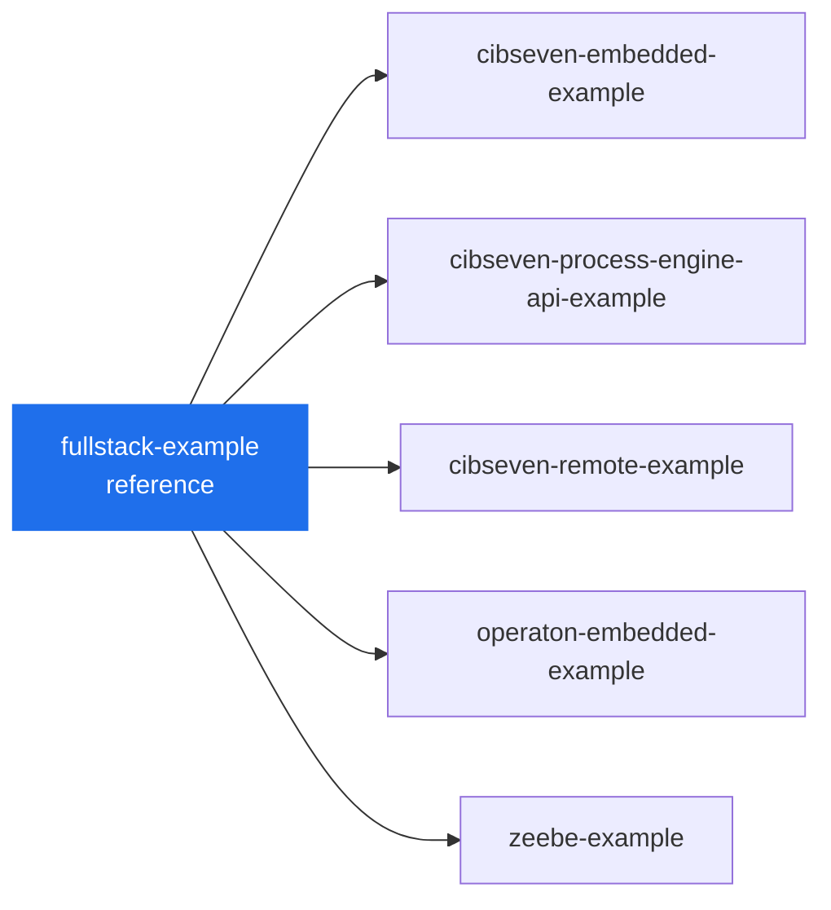

# Blueprint landscape

How the solution templates in this org relate, and how we keep them in sync. This is maintainer
documentation — the public pitch lives in [`profile/README.md`](../profile/README.md).

## The reference: `fullstack-example`

Every blueprint automates the **same** fictional MiraVelo bike-leasing process, on the same hexagonal
Kotlin / Spring Boot scaffolding. They differ only in the **process engine / runtime integration**.

`fullstack-example` is the functional **model for the whole family**: it carries the canonical domain,
architecture and the fullest surface (backend + React frontend + the first AI-agent setup). The
engine variants are effectively that example with one integration swapped out — a different engine, a
different way of wiring service tasks. Treat them as **descendants of `fullstack-example`**, not as
independent projects.

## Maintenance model

Because the variants inherit from the reference, changes flow **downstream**:

1. Land domain, architecture, scenario or tooling changes in `fullstack-example` **first**.
2. Propagate them into the engine variants, adapting only the engine-specific parts.
3. Keep engine-specific concerns (worker wiring, delegate style, broker config) local to each variant.

**Long-term goal:** replace the manual propagation in step 2 with **pipelines** that push shared
changes from `fullstack-example` into the variants automatically, so the family can't drift.

## Service landscape

Auto-generated from the org's public repos — see [Keeping this current](#keeping-this-current). Do not
edit the diagram or table by hand.

<!-- BEGIN:diagram (auto-generated by scripts/sync-landscape.sh — do not edit) -->

<!-- END:diagram -->

<!-- BEGIN:landscape (auto-generated by scripts/sync-landscape.sh — do not edit) -->
| Blueprint | What it demonstrates |
| --- | --- |
| [`fullstack-example`](https://github.com/miragon-blueprints/fullstack-example) | A example service you can use to start automating a process with front- & backend |
| [`cibseven-embedded-example`](https://github.com/miragon-blueprints/cibseven-embedded-example) | A ready-to-fork bike-leasing blueprint on CIB seven with an embedded engine — one complete, production-shaped BPMN service using JavaDelegates, Spring Boot & Kotlin 🚲 |
| [`cibseven-process-engine-api-example`](https://github.com/miragon-blueprints/cibseven-process-engine-api-example) | A ready-to-fork bike-leasing blueprint on CIB seven with an embedded engine, wired through the bpm-crafters process-engine-api — one complete, production-shaped BPMN service in Spring Boot & Kotlin 🚲 |
| [`cibseven-remote-example`](https://github.com/miragon-blueprints/cibseven-remote-example) | A ready-to-fork bike-leasing blueprint on CIB seven with a remote engine — a generic engine host plus a worker that owns the model and runs its logic as external tasks, in Spring Boot & Kotlin 🚲 |
| [`operaton-embedded-example`](https://github.com/miragon-blueprints/operaton-embedded-example) | A ready-to-fork bike-leasing blueprint for automating a business process on Operaton with an embedded engine, Spring Boot & Kotlin 🚲 |
| [`zeebe-example`](https://github.com/miragon-blueprints/zeebe-example) | A ready-to-fork bike-leasing blueprint for automating a business process on Zeebe / Camunda 8 with Spring Boot & Kotlin 🚲 |
<!-- END:landscape -->

## Keeping this current

The diagram and table above are regenerated by [`scripts/sync-landscape.sh`](../scripts/sync-landscape.sh)
(lists the org's non-archived public repos via `gh`) and refreshed weekly by
[`.github/workflows/sync-landscape.yml`](../.github/workflows/sync-landscape.yml). Run
`./scripts/sync-landscape.sh` locally, or trigger the workflow, after adding or renaming a blueprint.

Because the `main` ruleset blocks direct pushes and requires signed commits, the workflow doesn't push
to `main` — it opens a bot branch and squash-merges it (GitHub signs the squash commit), falling back to
native auto-merge if a required check is ever added to the ruleset. This needs the repo/org setting
**"Allow GitHub Actions to create and approve pull requests"** enabled ("Allow auto-merge" already is).
